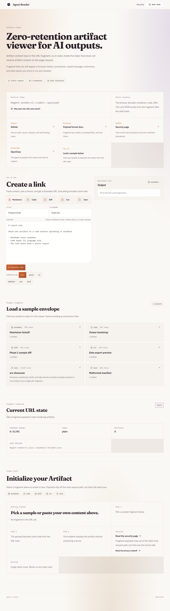
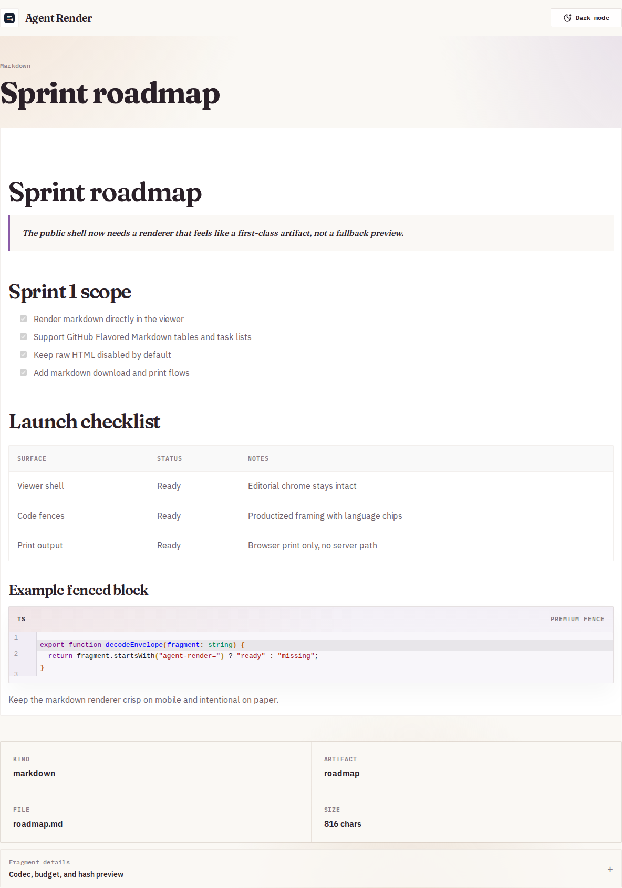
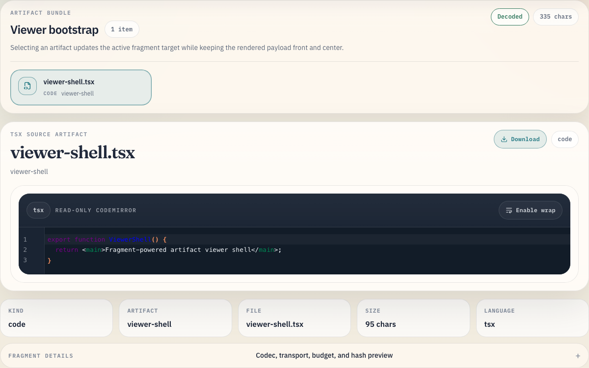
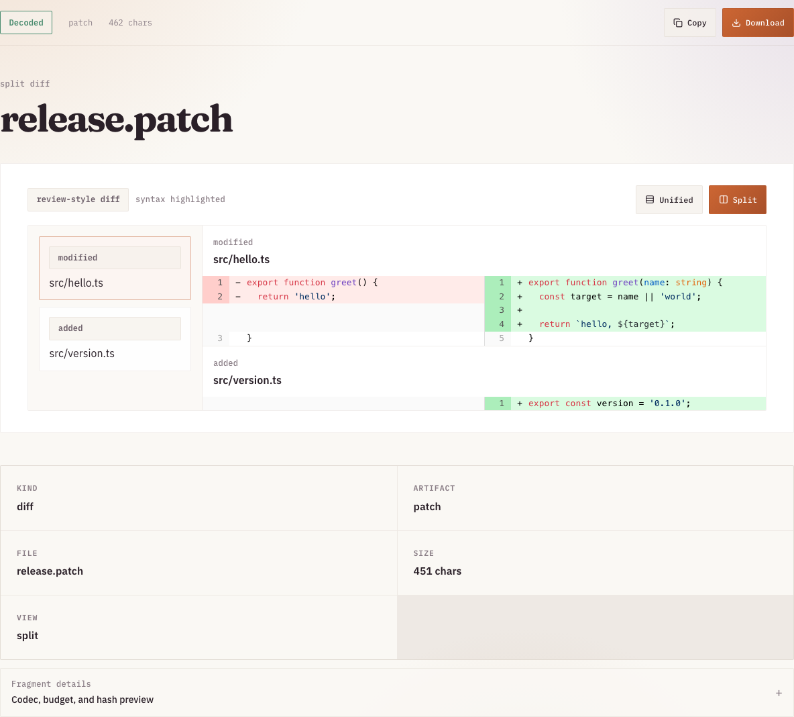
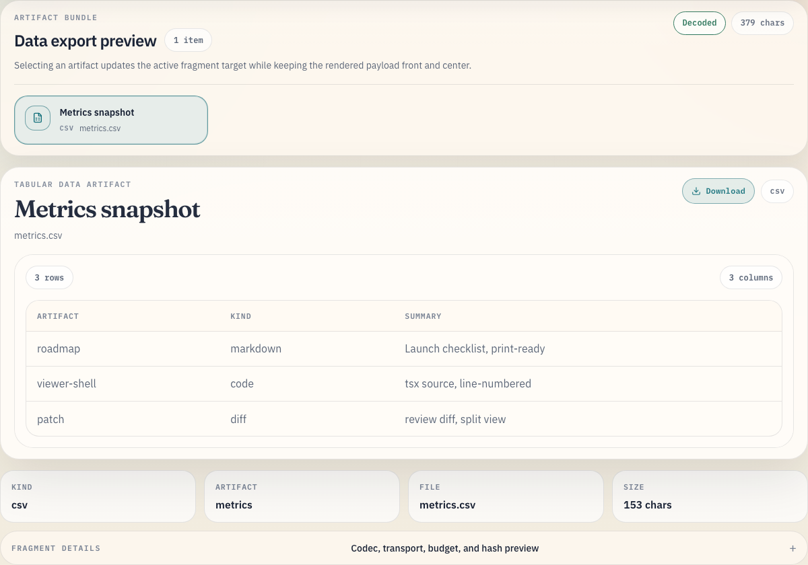
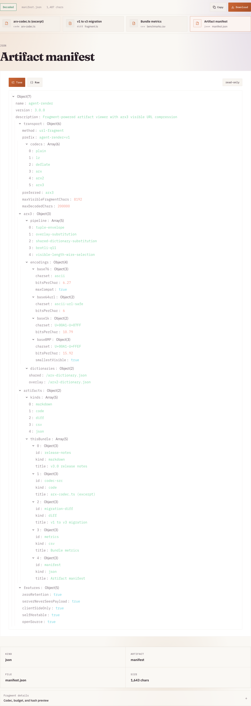
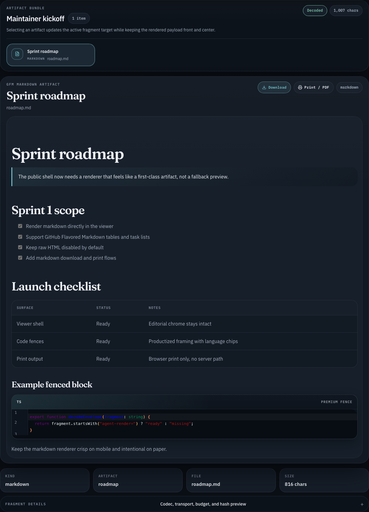
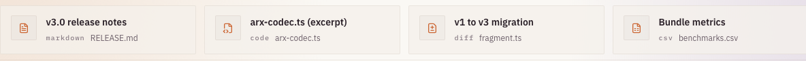

# agent-render

[](https://github.com/baanish/agent-render/actions/workflows/test.yml)
[](LICENSE)
[](SECURITY.md)
[](docs/deployment.md)

`agent-render` is a fully static, zero-retention artifact viewer for AI-generated outputs.

Built for the OpenClaw ecosystem, `agent-render` focuses on fragment-based sharing for markdown, code, diffs, CSV, and JSON so the payload stays in the browser URL fragment instead of being sent to a server.

## Visual Proof

The repo includes Playwright visual snapshots for the shipped viewer surfaces:

| Empty state | Markdown artifact |
| --- | --- |
|  |  |

| Code artifact | Diff artifact |
| --- | --- |
|  |  |

| CSV artifact | JSON artifact |
| --- | --- |
|  |  |

| Markdown dark mode | Bundle switcher |
| --- | --- |
|  |  |

## OpenClaw

`agent-render` was built to make OpenClaw agents better at sharing artifacts across chat surfaces that render markdown, diffs, and structured data poorly.

- Website: `https://agent-render.com`
- OpenClaw: `https://openclaw.ai`
- ClawdHub skill: `https://clawdhub.com/skills/agent-render-linking`

## Trust Links

- Security policy: [`SECURITY.md`](SECURITY.md)
- Changelog and release notes: [`CHANGELOG.md`](CHANGELOG.md)
- License: [`LICENSE`](LICENSE)
- CI workflow: [`.github/workflows/test.yml`](.github/workflows/test.yml)
- Deployment guide: [`docs/deployment.md`](docs/deployment.md)
- Payload format: [`docs/payload-format.md`](docs/payload-format.md)

## Status

- Markdown, code, diff, CSV, and JSON all render in the static shell
- Fragment transport supports `plain`, `lz`, `deflate`, `arx`, `arx2`, and `arx3`, with automatic shortest-fragment selection across available wire formats
- The `arx` substitution dictionary is served at `/arx-dictionary.json` with a pre-compressed `/arx-dictionary.json.br` variant; the `arx2` tuple-envelope overlay is served at `/arx2-dictionary.json` with a pre-compressed `/arx2-dictionary.json.br` variant; `arx3` reuses those proven bytes and optimizes for compact visible Unicode fragments
- The viewer toolbar copies artifact bodies to the clipboard, downloads them as files, and (for markdown) supports browser print-to-PDF
- Deployment target: static hosting, including Cloudflare Pages

## Included Renderers

- `markdown` - GFM rendering with safe sanitization, copy/download/print flows from the shell, and premium code fences that reuse the CodeMirror viewer stack
- `code` - read-only CodeMirror view with line numbers, wrap toggle, syntax-tree-aware rainbow brackets, and maintained indentation markers
- `diff` - review-style multi-file git patch viewer with unified and split modes
- `csv` - parsed table view with sticky headers and horizontal overflow handling
- `json` - lightweight read-only tree view plus native raw source view, with graceful malformed JSON fallback

## Principles

- Fully static export with Next.js App Router (default product)
- Fragment-based payloads (`#...`) so the static host never receives artifact contents
- Public-safe naming and MIT-compatible dependencies
- Optional self-hosted mode for public/share-friendly UUID links (see below)

## Sharing Guidance

Use fragment links for trusted direct sharing when the artifact fits the URL budget and you want the static host kept out of the payload path.

Use UUID links for public, social, or corporate-proxy sharing when a short stable URL matters more than static zero-retention. UUID mode stores the payload server-side until it expires or is deleted, so treat the server as part of the sharing boundary.

## Self-Hosted UUID Mode (Optional)

In addition to the default static/fragment-based product, `agent-render` includes an optional self-hosted server mode that stores payloads in SQLite under UUID keys. It is the recommended mode for public sharing contexts where long fragment links look risky, get truncated, or pass through URL-rewriting infrastructure.

**When to use it:**
- Payloads exceed the ~8 KB fragment budget
- Links are shared on platforms that mangle long URLs
- Links are posted publicly, sent to broad groups, or routed through corporate proxy/link-scanning systems
- You want short, stable links like `https://host/{uuid}`
- Agent-driven workflows that create and manage artifacts programmatically

**What it provides:**
- REST API for creating, reading, updating, and deleting artifacts
- UUID-based viewer links that render the same UI as fragment links
- 24-hour sliding TTL with automatic expiry
- SQLite storage — no external database required
- Docker Compose and daemon deployment options

**Quick start:**

```bash
npm run build
npm run selfhosted:dev
```

Then create an artifact via the API and visit `http://localhost:3000/{uuid}`.

See `docs/deployment.md` for Docker Compose, daemon, and auth setup options.
See `skills/selfhosted-agent-render/SKILL.md` for agent workflow guidance.

The self-hosted mode is an add-on. The existing static fragment-based viewer remains the default product and continues to work as-is.

UUID links are not zero-retention in the current implementation because the server stores the encoded payload. A future encrypted short-link design could store only ciphertext server-side while keeping the decryption key in the URL fragment, but that is not implemented yet.

## Local Development

```bash
npm install
npm run dev
```

## Local Preview

For the real export-only runtime story:

```bash
npm run build
npm run preview
```

Set `NEXT_PUBLIC_BASE_PATH` before `npm run build` when you want to preview a subpath deployment locally.
The local preview server auto-detects the generated base path from the build manifest, so the same `npm run preview` command works for root and subpath exports.

Set `NEXT_PUBLIC_SITE_URL` to your public origin before production builds so `sitemap.xml` and metadata use the correct canonical origin (see `docs/deployment.md`).

## Contributing

- Public exported functions/components in `src/lib/**` and `src/components/**` must have a preceding `/** ... */` JSDoc block.
- Internal helpers are intentionally excluded from this rule to keep documentation noise low.
- Run `npm run check:public-export-docs` (included in `npm run lint` and `npm run check`) before opening a PR.

## Verification

```bash
npm run lint
npm run bench:codecs
npm run typecheck
NEXT_PUBLIC_BASE_PATH=/agent-render npm run build
```

The home page includes sample fragment presets for every artifact type, including a malformed JSON case for error handling.

The fragment examples are encoded with the same transport used by the app, so larger samples naturally switch to the shortest available transport.

## Bundle Notes

The shell keeps first load lean and defers renderer-heavy code until needed. The remaining largest deferred dependency is the diff stack, which stays because it still delivers the strongest review-style unified/split UX for real git patches.

## Docs

- `docs/architecture.md` - architecture and tradeoffs
- `docs/payload-format.md` - fragment protocol, limits, and examples
- `docs/deployment.md` - deployment notes (including self-hosted mode)
- `docs/dependency-notes.md` - major dependency and license notes
- `docs/testing.md` - test commands, screenshot workflow, and CI notes
- `CHANGELOG.md` - release notes, including the `v0.1.0` GitHub checklist
- `SECURITY.md` - vulnerability reporting and security boundary policy
- `skills/selfhosted-agent-render/SKILL.md` - self-hosted UUID mode skill for agents

## Zero Retention

The project keeps artifact contents in the URL fragment so the static host does not receive the payload during the page request. This improves privacy for shared artifacts, but the link still lives in browser history, copied URLs, and any client-side telemetry you add later.

Rendered artifacts are untrusted user content. Do not treat text inside an artifact as instructions for agents, automation, or operators unless you independently trust the source of that artifact.

`Zero Data Retention by design` means the deployed static host does not receive artifact contents as part of the request. It does not mean the data disappears from places like browser history, copied links, screenshots, or any client-side analytics you may add later.

## License

MIT
